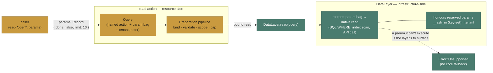
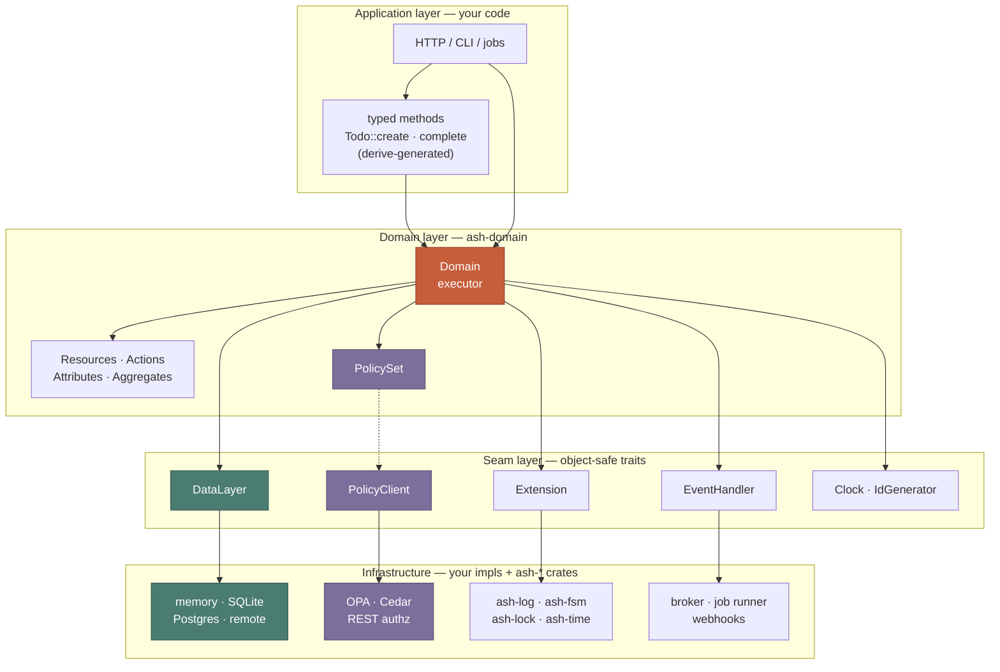
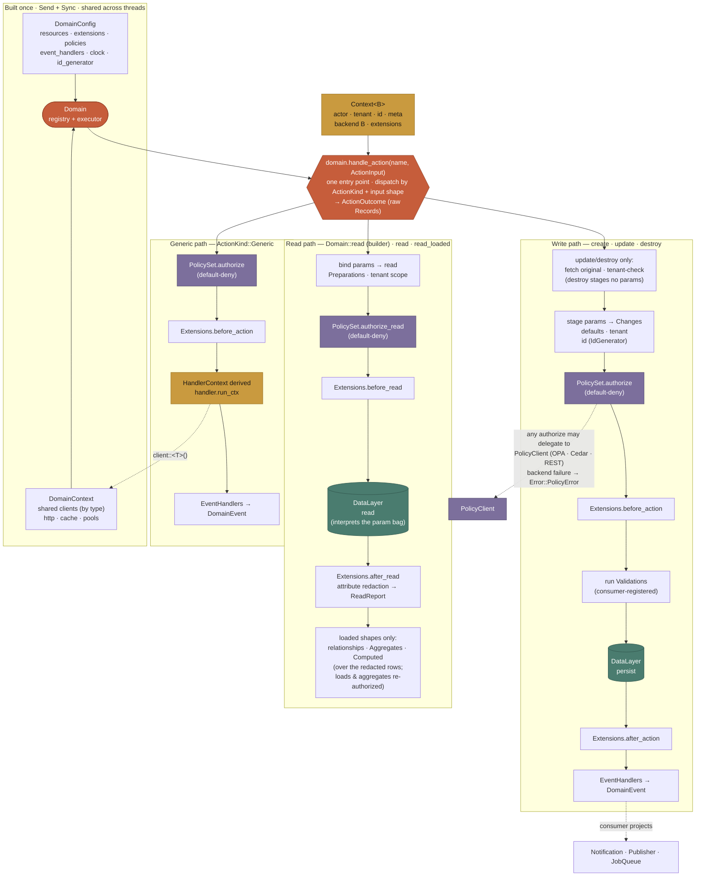
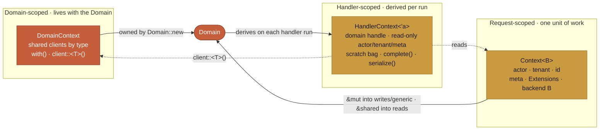

# Architecture

`ash-domain` is a resource-oriented domain framework. You declare **resources**
(typed attributes + actions), register them in a **`Domain`**, and run actions
through a per-request **`Context`**. Everything else — storage, authorization,
side effects, time, id generation — is a pluggable **seam** behind an
object-safe, `Send + Sync` trait. The core defines *what* each thing is and
*how* it's requested; it ships almost no engine (one in-memory data layer, a
system clock, a UUID generator). You extend the framework by implementing a
trait on your own type.

- **Data flows as dynamic `Record`s**, not concrete user structs, so the core,
  data layers, and every extension operate on any resource without knowing its
  Rust type.
- **Resources are types, not values** — a resource's schema is associated
  `const`s and functions; you never instantiate one.
- **`Send + Sync` throughout** — every seam trait requires it and `Domain` holds
  only `Arc` fields, so a `Domain` is `Send + Sync + Clone`: build on one thread,
  run on another, or clone across a thread pool.
- **Fail-closed by default** — authorization runs before anything observable on
  every path and is **default-deny with admit-on-affirmative** (an operation is
  forbidden unless some matching policy affirmatively allows it, and any matching
  policy may veto; running open takes an explicit `PolicySet::permissive()`), the
  config is validated at `Domain::new`. Reads are an opaque param bag the data
  layer interprets; the core defines no query language and evaluates nothing on a
  layer's behalf, so keeping degradation explicit is the layer's responsibility.

**Writes come in one row at a time or in a bounded batch.** `ActionInput::Batch`
runs the *whole* per-row pipeline for every row — staging, the operation gate,
the field-level write gate, `before_action`, validations — and only then hands
the rows to `DataLayer::create_many` in one call (whose default implementation
loops, so every existing layer already satisfies it). The two passes are
deliberately separate: nothing reaches the layer until every row has been
authorized, so one denied row persists none of the batch. Batch size is bounded
by `DomainConfig::max_batch` (`DEFAULT_MAX_BATCH` = 1,000), checked before a
single row is staged.

**Transactions are an optional seam.** A `Store` may implement
[`Store::begin`](src/context.rs) to hand the executor a
[`Transaction`](src/datalayer.rs) (itself a `DataLayer`); the CRUD write pipeline
then persists and runs `after_action` **inside** it and commits after — so a
failure before the commit rolls the write back. A store that declines (the
default) keeps the immediate-commit path. **Event delivery stays post-commit and best-effort by
default** — so the "an `Err` can be returned on a committed row" contract narrows
to just the event tail. See `docs/transaction-seam.md`.

**That last gap closes with the outbox seam.** `EventHandler::stage` is handed
each event *before* the commit, together with the transaction's own `DataLayer`
view, so a handler can write an outbox row in the same transaction as the write
it announces: the row and its event commit together, and a staging failure rolls
the write back. The core still ships no outbox table, no relay and no delivery
machinery — it only offers the transaction it already had; publishing from the
outbox is the consumer's process. A handler declares the dependency with
`EventHandler::stages`, and a store that offers no transaction makes the write
fail loudly (`Unsupported`) rather than silently downgrade the guarantee.

**Out of scope (by design).** The core has no **schema migration** engine: a
resource's attributes are runtime metadata, and mapping or evolving them against a
storage schema is the `DataLayer` implementor's concern, not the core's. It also
ships no transaction *runtime* (no 2PC, no distributed coordination, no outbox) —
the seam above only *uses* whatever atomicity a `Store` provides.

---

## Reads are a parameter bag, not a hand-built query

The core does not ask the caller to assemble a filter tree, sort keys, and
pagination by hand for every read. A read is issued as a **named action plus a
bag of parameters** — the exact same shape a write already takes (`params:
Record`). What those params *mean* — which attribute a `since` binds to, whether
`limit` is capped, how `q` fans out into a filter — is decided by the read
action's **`Preparation`s** and, ultimately, by the **`DataLayer`** that receives
them. The caller writes a `Record`; the resource author and the layer author own
the binding, validation, and translation.



There is **no core query language**: `Query` carries a `resource`, an opaque
`params: Record`, and a few executor-owned concerns (`load`, `tenant`,
`aggregates`, `computed`). The core defines no filter algebra — a layer
interprets the bag however it can (a SQL `WHERE`, an index scan, a custom wire
frame), and the reference in-memory layer defines its own private interpretation
of it. What the core *does* own, outside the bag, are the ordering and paging
contract points every layer must honour: `limit`, `sort`, and one of `after`
(keyset) or `offset`. Three consequences worth stating:

- **Binding is the layer's contract, validation is the resource's.** A
  `Preparation` rejects a malformed param bag (`Err` → `Error::Invalid`) before
  the layer is touched; the layer decides how a *well-formed* bag becomes a
  native read. A SQL layer compiles params to a prepared statement with bound
  placeholders; the in-memory layer reads its own `eq`/`sort`/`limit`/`cursor`
  param convention. Neither the caller nor the core hard-codes that mapping.
- **Tenancy and the actor ride along, not in the bag.** The tenant discriminator
  and the acting `actor` are set by the domain from the `Context`, not supplied
  as free params — so a caller cannot spoof either by stuffing the `Record`.
  Under the `Attribute` tenant strategy the domain folds the discriminator into
  the bag (via the reference layer's `eq` convention) *and* sets `Query::tenant`;
  a partitioning layer reads `Query::tenant` directly.
- **A small reserved-param vocabulary is the one part of the bag the core
  defines.** The executor issues its *own* internal reads — relationship loads
  and relationship-scoped filters — through reserved keys (`query::reserved`): a
  resolved key-set (`__ash_in`, "rows where `attr` ∈ `keys`") that **every layer
  must honour** for loads to work, and an unresolved relationship filter
  (`__ash_relates`) the domain resolves into a key-set before the layer runs.
- **Degradation is the layer's responsibility, not the core's.** The core no
  longer negotiates capabilities or evaluates queries on a layer's behalf: it
  hands the bag to `DataLayer::read` and trusts the layer to execute it or to
  surface what it cannot (e.g. `Error::Unsupported`) rather than degrade
  silently. A param a layer doesn't understand simply has no effect there.
- **Every read is bounded.** `Query::limit` is the one bound the core owns and
  every layer must honour. A caller who sets it has stated a deliberate page
  size; a caller who doesn't gets the domain's `max_rows` ceiling
  (`DEFAULT_MAX_ROWS` = 10,000) pushed down instead — so no read can pull an
  unbounded result set into memory by omission. The ceiling is applied by asking
  for **one row more** than it allows: if that row comes back, the read is
  *refused* (`Error::Unsupported`, naming the ways out) rather than truncated,
  because a silently partial answer is worse than an error. Unbounded reads stay
  possible and stay visible — `DomainBuilder::unbounded_rows()`. A layer that
  returns more rows than it was handed has broken the contract, and the domain
  says so (`Error::DataLayer`) instead of trusting the overrun.
- **Sorted reads and keyset pagination.** `Query::sort` is the second bound-like
  contract point: a compound order the layer must honour, checked against the
  resource's declared attributes at request time so a typo fails before the layer
  sees it. It is what makes `limit` mean *the first N* rather than *an arbitrary
  N* — a bounded read of unordered rows is a subset, not a page. `ReadRequest::page`
  runs the read and returns a `Page`, whose `cursor()` is an opaque position
  built from the last row's sort-key values; feeding it back through `.after()`
  resumes strictly past it. Because the cursor is a keyset and not an offset,
  paging neither skips nor repeats rows when the data changes underneath it. A
  short page reports no cursor, so the caller learns it has reached the end
  without an extra round trip. The cursor is built from the **raw** rows before
  redaction — a sort key the caller may not read is still a valid position, and
  redaction must not silently move where the next page starts.
- **Offset pagination, for random access only.** `Query::offset` is the second
  paging model: skip N rows of the sorted order, then apply the row bound. It
  exists because a keyset cursor cannot do the one thing a numbered pager needs —
  jump straight to page *n* — and it is deliberately the weaker choice, since a
  row inserted or removed before the offset shifts every later row, so a caller
  walking offsets can see a row twice or miss it. The two models are mutually
  exclusive on one query, and both require a sort; a read carrying an offset with
  no order, or an offset *and* a cursor, is refused as `Invalid` before the layer
  is reached, alongside the other shape checks. `ReadRequest::offset_page`
  returns an `OffsetPage`, which answers `has_more()` by reading one row past the
  page and dropping it, so the caller never pays a round trip to find the end —
  and is never handed the probe row. It exposes no total: the layer was never
  asked to count, and the core does not make it.

- **Nested loads are depth-bounded.** A load path is caller-shaped
  (`"comments.author.posts"`) and each level fans out over the rows the level
  above returned, so depth is bounded by `max_load_depth` (`DEFAULT_MAX_LOAD_DEPTH`
  = 4) exactly as width is bounded by `max_rows`. It matters because the
  relationship graph may be **cyclic** — `author → posts → author → …` is a legal
  declaration — so without a ceiling a caller can walk it as far as they care to
  type. The check runs on the requested paths **before any read issues**, not even
  the top-level one: a request that cannot be served whole is refused whole, since
  serving its first level and truncating the rest would return a partial object
  graph indistinguishable from a complete one. There is deliberately no unbounded
  opt-out; the cost of a deep load is multiplicative in a way a row bound cannot
  cap.

### Optimistic concurrency — the lost-update seam

A read-modify-write through `update` is two round trips, and between them another
writer can land. Without a version check the second write silently overwrites the
first: no error, no trace, and the lost change is only discovered later, if ever.

A resource opts into protection by naming its version column —
`Resource::version_attribute`, identified **by name** exactly as `primary_key`
is, and validated at `Domain::try_new` (declared, and integer-typed) so a typo
fails at construction rather than quietly disabling the guarantee.

The mechanism is deliberately thin. Every update on such a resource must carry
the version it read — the caller's own param, because that is the value it
actually saw; defaulting to the stored row's version would compare the row
against itself and always pass. The domain stamps the **next** version
authoritatively over whatever the caller sent (as it already does for the tenant),
then calls `DataLayer::update_versioned`, whose contract is that the compare and
the write are **one atomic step**. A stale version fails with `Error::Conflict` —
a legitimate outcome to retry, distinct from `Contention` (a lock was never
taken) and from a fault.

The core ships no retry loop, no version generator, and no snapshot store: it
supplies the check and the error, and re-applying the change is the caller's.
Layers that cannot do a conditional write **decline** (`update_versioned`
defaults to `Error::Unsupported`) rather than degrading to an unconditional
update — the same "degradation is explicit, never silent" rule as everywhere
else. The conformance kit checks all three behaviours, including that a stale
write is actually refused.

**Redaction declares itself.** Attribute redaction consults every matching policy
once **per row per attribute**, so at the default `max_rows` ceiling one read can
make tens of thousands of policy calls. `Policy::redacts()` lets a policy say it
never votes on field visibility (it leaves `authorize_attribute_read` at the
default), and the domain then skips it — both in the set-level "is this pass
needed at all" check and inside the per-attribute scan, so a set mixing both kinds
only pays for the policies that actually redact. It defaults to **`true`**, the
fail-safe direction: a policy that says nothing is still consulted, so the flag
can only ever remove work a policy explicitly disclaimed. It governs the read side
only — field *writes* are gated regardless, because a forbidden write fails the
whole action and is never skipped for performance.

### Typed queries — `read`, reached through `domain.query`

The param-bag read above returns rows of the resource being read. Sometimes you
want a read whose **result is a custom shape** — a projection, a join, a rolled-up
aggregation that isn't any one stored resource. That is what `domain.query` is
for. It is **not a new path**: it is the ordinary `Read` — same
`authorize_read` gate, same attribute redaction into a `ReadReport` — entered
through a different method so it can return a **user-declared aggregation
resource** instead of the base resource's rows.

You declare the aggregation as its own `Resource` (its attributes are the
projected/derived columns), write a query trait for it, and `impl` that trait on
your concrete backend with the hand-written read (the SQL join, the `GROUP BY`).
Because the method is generic over the query type, it can't ride the erased
`Arc<dyn DataLayer>` — it runs against the **concrete backend** through
`Context<B>`, alongside (not through) the erased CRUD the `Domain` already holds:

```rust
// The aggregation is a normal Resource — its attributes are the result columns,
// and its Read policies gate + redact the result.
struct TodoStatsByOwner;   // owner_id · open_count · done_count
impl Resource for TodoStatsByOwner { /* attributes(), a Read action */ }

// A capability the query needs; the concrete backend implements the ones it
// supports (this is the "impl your own thing" seam — one trait per query).
#[async_trait]
trait TodoStats {
    async fn todo_stats_by_owner(&self) -> Result<Vec<Record>>;
}

#[async_trait]
impl TodoStats for PostgresLayer {
    async fn todo_stats_by_owner(&self) -> Result<Vec<Record>> {
        // hand-written SELECT owner_id, COUNT(*) FILTER (…) … GROUP BY owner_id
    }
}

// The typed query itself: names the result resource and runs against the
// concrete backend B (bounded on the capability it needs). Off the action
// pipeline — no changeset, no preparations, no events.
struct StatsByOwner;
#[async_trait]
impl<B: Store + TodoStats> TypedQuery<B> for StatsByOwner {
    type Resource = TodoStatsByOwner;
    async fn run(&self, ctx: &Context<B>) -> Result<Vec<Record>> {
        ctx.backend().todo_stats_by_owner().await
    }
}

// Called through the domain: authorize (as a Read of TodoStatsByOwner) →
// run against the concrete backend → redact the result rows.
let stats = domain.query(&ctx, StatsByOwner).await?;
```

Two things to hold onto:

- **It is authorized like any read of its result resource.** The `Read` policy
  surface of `TodoStatsByOwner` applies: the operation gate must admit under
  default-deny, and its attributes redact under their own policies (use
  `query_authorized` for the `ReadReport` of what was hidden). Nothing about
  going through `query` weakens authorization — it just changes the shape that
  comes back.
- **Scoping the read is still the implementor's job.** Policies gate and redact
  the *result*; they don't inject a tenant/actor predicate into your hand-written
  query. A typed query over a tenant-scoped aggregation must filter by
  `ctx.tenant()` itself, exactly as a `DataLayer::read` impl must.

(Macros to cut the per-query trait boilerplate can come later; the shape above is
what they'd expand to.)

---

## The registry, as data

`Domain::schema()` hands the validated registry back as an inspectable,
serializable `DomainSchema` — every resource's attributes (with their types
mapped off the declared Rust type), relationships, aggregates, computed fields,
actions, primary key, storage name and tenant strategy. It is a pure projection:
no I/O, no clock, no layer, no policy evaluation, and byte-stable across runs.
`to_json_schema()` renders the same thing as a JSON Schema 2020-12 document,
with what JSON Schema has no word for (relationships, actions, aggregates)
riding along under an `x-ash` key rather than being dropped.

This is what makes "model your domain, derive the rest" mean something outside
the executor: an API description, an admin UI, a client type, a fixture
generator and a doc page can all be generated from the same declaration the
pipeline runs, instead of being hand-maintained beside it.

It describes the **declared** shape, never a per-caller view. Attribute redaction
is decided per row and per actor at read time, so no static document can say what
a given caller will see; the schema reports only the static fact — whether a
policy is scoped to an attribute by name.

---

## Layered view

Who calls whom, top to bottom: your application drives the domain; the domain
only ever talks to traits; your infrastructure implements them.



---

## System architecture

One diagram per execution path — each action kind flows through a different
subset of the machinery, so they are drawn separately rather than merged.



Notes on the paths:

- **One entry point, dispatched by kind.** Every action runs through
  `domain.handle_action::<R>(&mut ctx, name, input)`. The action is resolved by
  name, and the pair (its declared `ActionKind`, the shape of the
  [`ActionInput`]) selects the path: `Write` + params-without-id → create, `Write`
  + params-with-id → update, `Write` + id-only → destroy, `Read` + query → read,
  `Generic` + params → the handler. The result is an `ActionOutcome` carrying raw
  `Record`s (`Record` / `Records` / `Value` / `Unit`); project it into the
  resource's typed `Data` with `.into_data()` / `.into_data_vec()`. The
  `#[derive(Resource)]` typed methods (`Todo::create`, `complete`, …) are thin,
  compile-checked wrappers over this one call — the name baked in, the outcome
  projected back — so there is exactly one execution surface underneath. The
  erased read arm resolves no `load`/`aggregates`/`computed` and **rejects** a
  query carrying them (`Error::Invalid`, never a silent drop); build its input
  with `Filter`, which cannot carry them.
- **Reads have a typed, composable front door: the `Domain::read::<R>(&ctx)`
  builder** (`ReadRequest`). It names the resource once, by type (no resource
  string to mismatch — the executor stamps `Query::resource` on every read
  path), and tracks *loads* and *report* in its type-state, so the requested
  combination decides the output: plain → `Vec<R::Data>`, `.with_report()` →
  `AuthorizedRead<_>`, `.load(…)`/`.aggregate(…)`/`.computed(…)` →
  `Vec<Loaded<_>>`, both → `AuthorizedRead<Loaded<_>>` (the pairing the older
  `read_authorized` / `read_loaded` entry points cannot express; they remain as
  the underlying calls). `.filter(k, v)` params stay a layer-owned bag —
  the builder adds no filter algebra over them (`.params(bag)` merges a whole
  user-typed `IntoRecord` struct into the same bag: a compile-checked spelling,
  still layer-owned meaning). Ordering and paging are the exception, because they
  are core contract points rather than params: `.sort_asc`/`.sort_desc` with
  either `.after(cursor)` or `.offset(n)`, finished by `.page()` or
  `.offset_page()`.
  `get(id)` and `explain()` are its one-row and dry-run terminals; typed
  queries still use `query` (see above).
- **Authorization runs first on every path** — only pure staging (the action's
  declared changes, defaults, stamps, and the bound read from its preparations)
  precedes it, so policies judge the changeset/read **as the caller staged it**.
  Nothing that changes state or is visible to the caller happens for a denied
  request: no effecting extension hook fires, no lock is acquired, and validation
  validity is never reported before the gate (a denied caller sees `Forbidden`,
  never `Invalid`). The sole exception is the read-only `on_denied` extension
  hook, which the executor calls *at* the gate so a denial can be **recorded**
  (the audit extension emits an `AuditResult::Denied` event); it cannot alter the
  outcome or leak anything to the caller.
- **Extensions run *inside* the authorization gate — a trust boundary.** Policies
  gate the caller; extensions (`W3`/`W6`, `R3`/`R5`, `G2`) are
  deployment-installed, domain-side code trusted to uphold the rules from within.
  Two intentional consequences: a write extension's `before_action` runs *after*
  the gate and may mutate the changeset (those edits are **not** re-authorized),
  and a read extension's `after_read` (`R5`) sees rows **before** attribute
  redaction (the un-redacted values). Install only code you trust with unredacted
  data and unchecked changeset edits.
- **Authorization is default-deny, admit-on-affirmative.** An operation is
  forbidden unless some matching policy affirmatively **allows** it, and any
  matching policy may **veto** it (`Forbid`/`Error` win). Crucially, *matching a
  scope is not consent*: a policy may match a target and abstain
  (`NotApplicable`), so registering a field-redaction policy never widens the
  operation gate — adding a policy can only narrow access, never open it. An
  empty `PolicySet` denies everything; to admit operations, register a policy
  that affirmatively allows (`Admit` / `AllowAll`, or your own), or state
  `PolicySet::permissive()` to run open. (Attribute *visibility* within an
  authorized read is the documented exception: fields are visible unless a
  policy forbids them, since default-denying un-policied fields would redact
  primary keys.)
- **Validations run on writes only** and are entirely consumer-supplied — the
  core ships no built-in attribute validation. A write action's registered
  `Validation`s run after `before_action`, before persist, and abort with
  `Error::Invalid` on rejection. Reads are authorized but not validated; read
  *input* is instead shaped by the read action's `Preparation`s (a malformed
  param bag aborts with `Error::Invalid` before the layer is touched).
- **Event delivery is post-commit and best-effort** (`W7`, `G4`). By the time
  handlers run, the write is persisted and *cannot be rolled back* — the core
  has no transaction seam. Handlers fire in registration order; the first `Err`
  stops the rest and propagates as the action's result, so a CRUD call can
  return `Err` on a row that is committed and readable. Delivery is in-process
  and un-retried; a handler that must not block the action swallows its own
  failures, and durability (outbox/retry) is a consumer concern.
- **`HandlerContext` exists only on the generic path** — it is derived per
  handler run and **consumed** (`complete(self)`) when the handler returns, so
  reusing a spent context is a compile error, not a runtime panic.
- **`read_loaded` extras** (relationships, aggregates, computed fields) apply
  only when the caller asks for them; loaded relations are gated like a direct
  read of the destination resource, and an aggregate is authorized like a read
  of its destination *before* the layer is asked to compute it (push-down
  included). A load carries **no caller-supplied action name** (the caller named
  an action on the source, not the destination), so it authorizes the
  destination under that resource's **first declared `Read` action** (falling
  back to `"read"`) — register an admit there to permit the load under
  default-deny. Computed fields run over the **already-redacted** rows — a
  `Computer` never sees a value an attribute policy hid — and aggregate /
  computed *outputs* are themselves redactable under their declared names.
  Reads take `&Context` (shared), so relationship loads at each level, aggregate
  push-downs, and per-row computed fields all resolve concurrently.
- **The layer owns query execution and any degradation.** The core hands the
  whole param bag to `DataLayer::read` and evaluates nothing itself — there is no
  capability negotiation and no in-core fallback. A layer executes what it can
  and surfaces what it cannot (e.g. `Error::Unsupported`) rather than degrade
  silently; a param it doesn't interpret simply has no effect. The one part of
  the bag the core defines is the reserved-param set (`__ash_in` key-set,
  `__ash_relates` relationship filter, plus `Query::tenant`) — a layer **must**
  honour `__ash_in` for relationship loading to work. Relationship-scoped filters
  (`__ash_relates`) are resolved into a key-set by the executor before the layer
  runs, reading the related keys through the abstract data layer.
- **Any authorize step** (`W2`, `R2`, `G1`) may be backed by a `PolicyClient`;
  a backend failure fails closed as `Error::PolicyError`, distinct from a
  deliberate `Error::Forbidden`.
- **The registry is validated at `Domain::new`** (`try_new` for the fallible
  form): unknown relationship destinations, missing join attributes, aggregates
  over undeclared relationships, name collisions, and policies scoped to
  nonexistent targets all fail at construction, not at request time.

---

## The context model — three scopes



Solid arrows are ownership/dataflow into the domain; dashed arrows are what the
derived handler context can *reach*.

- **`DomainContext`** — built **once**, passed to `Domain::new`, owned by the
  domain for its lifetime. Holds long-lived **shared clients** (HTTP, cache
  pools, external service handles), keyed by type.
- **`Context<B>`** — the **per-unit-of-work** handle. Request-scoped state:
  `actor`, `tenant`, correlation `id`, `meta`, a typed `Extensions` bag, and a
  backend `B` (the data layer). Created fresh per request. Writes and generic
  actions take it `&mut` (they stage into it); reads take it `&Context` (shared),
  which is what lets `read_loaded`'s relationship loads, aggregate push-downs,
  and computed fields resolve concurrently.
- **`HandlerContext<'a>`** — **derived per handler run**. Read-only view of
  actor/tenant/meta, a handle to the domain, `client::<T>()` access to the
  `DomainContext`'s clients, and its own `scratch` bag. `complete(self)`
  **consumes** it when the run ends (yielding the scratch bag), so a spent
  context can't be reused — enforced by the compiler, not a runtime check. The
  handler **may choose** to return a `serialize()`d snapshot of its context
  alongside its result; nothing is fed back into the domain.

---

## Putting it together

A single `Todo` resource, declared with `#[derive(Resource)]`: the default CRUD
actions, a **custom `complete` action** that carries its own typed method, one
derived read value, an owner-only authorization rule, and a read issued as a
**param bag** the resource binds. One block covers declaration, behavior, build,
and the ways an action is run — the derive-generated typed method *and* the
single `handle_action` entry point they both wrap.

```rust
// 1. Declare the resource. The derive infers one Attribute per field and emits
//    the default CRUD actions (`create` / `read` / `update` / `destroy`), a typed
//    method for each, `type Data = Self`, and the Record conversions.
//
//    `#[action(update, name = "complete")]` declares ONE custom action beyond the
//    CRUD set: the derive adds its ActionDef and a compile-checked
//    `Todo::complete(&app, &mut ctx, id, params)` method. The attribute only
//    *declares* the action — its behavior (below) is attached as explicit code.
#[derive(Resource, Default)]
#[resource(name = "todo")]
#[action(update, name = "complete")]
struct Todo {
    #[attribute(primary_key)]
    id: String,
    title: String,
    #[attribute(default = false)]
    done: bool,
    owner_id: String,
    // Timestamps are consumer-driven now — a `Change` that stamps `created_at`
    // from the Clock, not attribute metadata.
    created_at: i64,
}

// 1b. Behavior for the custom action, attached as explicit code: a `Change` that
//     forces `done = true`. Because the derive owns `actions()`, wire the change
//     by registering it against the `complete` action (a hand-written `actions()`
//     override, or a change registered on the domain) — the derive declares the
//     action; you supply what it does. A derived read value rounds out the shape.
struct MarkDone;
#[async_trait]
impl Change for MarkDone {
    async fn change(&self, cs: &mut Changeset) -> Result<()> {
        cs.set_attribute("done", true);  // the caller need not pass it
        Ok(())
    }
}
// (Todo also exposes a derived `age_days` computed field, resolved per row.)

// 2. Authorization: an owner may only act on their own todos. Under default-deny,
//    `OwnerOnly` must *affirmatively* admit — Decision::Allow when
//    actor.id == todo.owner_id, Decision::Forbid otherwise. A resource with no
//    admitting policy stays forbidden.
let policies = PolicySet::new()
    .with(ScopedPolicy::resource("todo", "owner-only", Arc::new(OwnerOnly)));

// 3. Build the domain once — with its shared-client bag (empty here).
let app = Domain::new(
    DomainConfig { resources: vec![erase::<Todo>()], policies, ..Default::default() },
    DomainContext::new(),
);

// 4. Per request: a Context carrying who is acting. The data layer is the only
//    thing that turns the param bag into a native read; here it's the reference
//    in-memory layer, which reads its own `eq`/`sort`/`limit` param convention.
let mut ctx = Context::new(Arc::new(InMemoryDataLayer::new()));
ctx.set_actor(current_user);

// 5a. Write via the derive's typed method — returns a typed `Todo`, not a Record.
let todo: Todo =
    Todo::create(&app, &mut ctx, Record::from_iter([("title", "Ship v1")])).await?;

// 5b. The SAME action via the single entry point. handle_action dispatches by the
//     action's kind + the input shape; the outcome carries raw Records, projected
//     back with `.into_data()`. `Todo::create` above is exactly this call, wrapped.
let todo: Todo = app
    .handle_action::<Todo>(&mut ctx, "create",
        ActionInput::create_record(Record::from_iter([("title", "Ship v1")])))
    .await?
    .into_data::<Todo>()?;

// 5c. Read — the typed builder names the resource once, by type; what you
//     request decides what `.await` returns. `filter` params stay a layer-owned
//     bag ({ done, limit } mean whatever the layer/preparations decide, exactly
//     as before); `computed` moves the request into the loaded shape (rows come
//     back as `Loaded<Todo>`, resolved over the redacted rows).
let open = app
    .read::<Todo>(&ctx)
    .filter("done", false)
    .filter("limit", 10)
    .computed("age_days")
    .await?;

// 5d. The custom action, both ways. The typed method reads like domain vocabulary;
//     handle_action("complete", …) reaches the identical authorized pipeline by
//     name. Either fires the todo.complete DomainEvent post-commit.
let done: Todo = Todo::complete(&app, &mut ctx, todo.id.clone().into(), Record::new()).await?;
app.handle_action::<Todo>(&mut ctx, "complete",
    ActionInput::update_record(todo.id.into(), Record::new())).await?;

// 5e. Typed query — a `read` reached through `query`, returning a custom
//     aggregation resource. Authorized/redacted as a Read of its result resource;
//     runs against the concrete backend (generic over B), off the action path.
let stats = app.query(&ctx, StatsByOwner).await?;
```

> One execution surface underneath: `Todo::create` and `Todo::complete` are
> compile-checked wrappers over the same `handle_action` the dynamic caller uses,
> so the typed and by-name doors reach the identical authorized pipeline. The
> `Domain` is `Send + Sync + Clone`, so `app` can be cloned across a thread pool:
> one domain, a fresh `Context` per request, and each read is just a param bag the
> resource and layer know how to bind.
